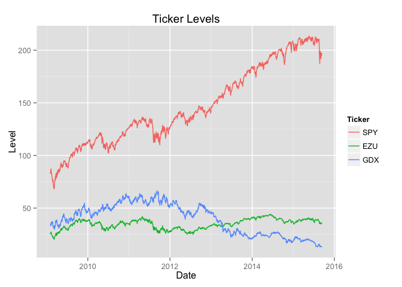
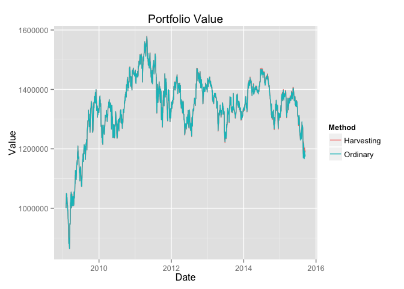

# Tax Loss Harvesting 2
## Synopsis

## Code Horrors

```r
library(dplyr)
```

```
## 
## Attaching package: 'dplyr'
## 
## The following objects are masked from 'package:stats':
## 
##     filter, lag
## 
## The following objects are masked from 'package:base':
## 
##     intersect, setdiff, setequal, union
```

```r
library(reshape2)
library(ggplot2)
```
### What's the aim


### The Global Scope
What we need really calls for classes and objects but since I haven't yet gotten that far in R, instead we use it's older, prodigal brother, The Global Scope.

The following variables are used for each simulation to store data that is shared and modified by the various methods. They need to be reset between each run.

```r
capital_gains_tax <- 0.25
capital_gain_loss <- NULL # Stores what PNL is not yet taxed/used to offset gains
buy_history <- NULL # list of ticker -> list of quantity and buy price (arrays of equal length)
last_tax_year <- NULL # last year we paid tax, we pay tax on the first business day of each year
```


```r
#' reset_global_variables
#' 
#' Resets the global variables. MUST be called before each run.
reset_global_variables <- function(target_weights, prices, value=1e6, tax_rate=0.25) {
  capital_gains_tax <<- tax_rate
  capital_gain_loss <<- 0
  last_tax_year <<- NULL
  set_up_buyhistory(target_weights, prices, value)
}
```

### And now the rest of the code

```r
#' single_ticker_close_values
#'
#' Returns data frame with columns 'Date' and 'Close' for input ticker.
single_ticker_close_values <- function(ticker, from_year) {
  URL <- sprintf('http://ichart.finance.yahoo.com/table.csv?s=%s&a=1&b=1&c=%d&g=d&ignore=.csv', ticker, from_year)
  data <- read.csv(URL, stringsAsFactors=FALSE)
  data$Date <- as.Date(data$Date)
  data <- data[,c('Date', 'Close')]
  
  return(data)
}

#' rename_column
#'
#' Renames column in given data frame from oldname to newname. Returns data frame.
rename_column <- function( df, oldname, newname) {
  colnames <- names(df)
  colnames[which(colnames==oldname)] <- newname
  names(df) <- colnames
  
  return(df)
}

#' multiple_ticker_close_values
#'
#' Takes string vector of tickers and returns data frame with columns 'Date' and one for each ticker (named as ticker).
#' Only dates for which there are close values for all tickers are kept in the output.
#' Output data frame is sorted by date (ascending).
multiple_ticker_close_values <- function(tickers, from_year) {
  first_ticker <- tickers[1]
  data <- single_ticker_close_values(first_ticker,from_year)
  data <- rename_column(data, 'Close', first_ticker)
  
  tickers <- tickers[-1]
  for(t in tickers) {
    d <- single_ticker_close_values(t,from_year)
    d <- rename_column(d, 'Close', t)
    data <- inner_join(data, d, by='Date')
  }
  
  data <- arrange(data, Date)
  
  return(data)
}

#' calculate_quantities
#'
#' Takes buy_history, a list of ticker -> 2-element list of price/quantity (same length) and returns
#' a list of ticker -> quantity.
calculate_quantities <- function(buy_history) {
  lapply(buy_history, function(x) sum(x$quantity))
}

#' calculate_weights
#'
#' Takes list of ticker -> quantity, list/data frame row of ticker -> price
#' and returns list of ticker -> weight in portfolio.
calculate_weights <- function(quantities, prices) { 
  weights <- list()
  total <- 0
  tickers <- names(quantities)
  
  for(t in tickers) {
    weights[t] <- quantities[[t]] * prices[[t]]
    total <- total + weights[[t]]
  }
  
  lapply(weights, function(v) v/total)  
}

#' set_up_buyhistory
#' 
#' initializes buy_history (global scope) with the purchases needed to reach the target weights.
set_up_buyhistory <- function(target_weights, prices, value=1e6) {
  hist <- list()
  tickers <- names(target_weights)
  for(t in tickers) {
    price <- prices[[t]]
    quantity <- value / price * target_weights[[t]]
    hist[[t]] <- list(quantity=quantity, price=price)
  }
  
  buy_history <<- hist # Global assignment
}

#' do_rebalancing
#' 
#' Returns TRUE/FALSE depending on whether the portfolio should be rebalanced.
do_rebalancing <- function(weights) {
  max_weight <- NULL
  min_weight <- NULL
  maxmin <- function(w) {
    max_weight <<- max(max_weight, w)
    min_weight <<- min(min_weight, w)
  }
  lapply(weights, maxmin)
  
  max_weight - min_weight > 0.05
} 

do_taxes <- function(date) {
  # First time called we initialize with the year.
  if(is.null(last_tax_year))
    last_tax_year <<- format(date,'%Y')
  
  current_year <- format(date,'%Y')
  
  if(current_year != last_tax_year) {
    last_tax_year <<- current_year
    return(TRUE)
  }
  
  return(FALSE)
}

#' calculate_total_value
#' 
#' Returns total portfolio value based on input quantities and prices.
calculate_total_value <- function(quantities, prices) { 
  total <- 0
  tickers <- names(quantities)
  for(t in tickers) 
    total <- total + quantities[[t]]*prices[[t]]
  
  total
}

calculate_termination_value <- function(buy_history, prices, capital_gain_loss) {
  quantities <- calculate_quantities(buy_history)
  total_value <- calculate_total_value(quantities, prices)
  tickers <- names(quantities)
  
  PNL <- 0
  
  for(t in tickers) {
    hist <- buy_history[[t]]
    current_price <- prices[[t]]
    for(idx in 1:length(hist$quantity)) {
      PNL <- PNL + hist$quantity[idx] * (current_price - hist$price[idx])
    }
  }
  
  tax_to_pay <- max(capital_gain_loss + PNL,0)*capital_gains_tax
  
  total_value - tax_to_pay
}

#' transact_in_ticker
#' 
#' Buys or sells in given ticker the stated quantity at the stated price.
#' NOTE: This modifies 'capital_gain_loss' and 'buy_history' in the wider world.
transact_in_ticker <- function(ticker, quantity, price) {
  history <- buy_history[[ticker]]
  if(quantity>0) {
    history$quantity <- c(history$quantity, quantity)
    history$price    <- c(history$price, price)
   } else if(quantity<0) {
    indices_to_remove <- NULL
    for(idx in length(history$quantity):1) {
      transaction_q <- history$quantity[idx]
      transaction_p <- history$price[idx]
      
      if(transaction_q > -quantity) {
        history$quantity[idx] <- transaction_q + quantity
        capital_gain_loss <<- capital_gain_loss + (-quantity)*(price-transaction_p) # Global assignment
        break
      } else {
        indices_to_remove <- c(indices_to_remove, idx)
        quantity <- quantity + transaction_q #remember quantity < 0; bring closer to 0
        capital_gain_loss <<- capital_gain_loss + transaction_q*(price-transaction_p) # Global assignment      
      }     
    }
    
    if(!is.null(indices_to_remove)) {
      history$quantity <- history$quantity[-indices_to_remove]
      history$price <- history$price[-indices_to_remove]
    }
  }
  print(sprintf('cap gain loss after transaction: %f', capital_gain_loss))
  buy_history[[ticker]] <<- history #Global assignment
}

harvest <- function(current_prices) {
  tickers <- names(buy_history)
  for(t in tickers) {
    history <- buy_history[[t]]  
    price <- current_prices[[t]]
    
    buys_to_remove <- NULL
    quantity_to_buy <- 0
    for(idx in length(history$quantity):1) {
      bought_price <- history$price[idx]
      bought_quantity <- history$quantity[idx]
      
      if(bought_price > price) {
        buys_to_remove <- c(buys_to_remove, idx)
        quantity_to_buy <- quantity_to_buy + bought_quantity
        
        # Accumulate capital losses
        capital_gain_loss <<- capital_gain_loss + bought_quantity*(price-bought_price) # Global
      } else break
    }
    
    # If we discovered anything to sell out, sell and rebuy
    if(!is.null(buys_to_remove)) {
      history$quantity <- history$quantity[-buys_to_remove]
      history$price <- history$price[-buys_to_remove]
      
      buy_history[[t]] <<- history # Global
      transact_in_ticker(t, quantity_to_buy, price) # Now rebuy the sold out quantity
    }
  }
}

run_simulation <- function(
 tickers, # vector of tickers
 do_harvest=TRUE, # whether to do tax-loss harvesting
 starting_value=1e6,
 tax_rate=0.25,
 starting_year=2009
) {  
  df <- multiple_ticker_close_values(tickers, starting_year) 
  
  # Equi-weighted portfolio
  intended_weights <- sapply(tickers, function(x) 1/length(tickers))
  
  reset_global_variables(intended_weights, df[1,], starting_value, tax_rate)
  
  values <- NULL # Vector of values assuming the portfolio was terminated (and thus subject to tax)
  pretax_values <- NULL # Vector of current value of portfolio (pre-tax)
  gain_loss_history <- NULL # Vector of accumulated capital gains/losses
  taxes_paid <- NULL # Vector of the taxes paid (variable length)
  
  for(index in 1:dim(df)[1]) {
    row <- df[index,]
    current_date <- row$Date
    current_quantities <- calculate_quantities(buy_history)
    current_weights <- calculate_weights(current_quantities, row)
    
    tax_time <- do_taxes(current_date) #Remembers year so can only be called once per date
    gain_loss_history <- c(gain_loss_history, capital_gain_loss)
    
    # Rebalance portfolio on sunny days
    if(do_rebalancing(current_weights) || tax_time) {
      print(sprintf('Rebalancing on %s', current_date))
      total_value <- calculate_total_value(current_quantities, row)
      
      if(do_harvest) {
        harvest(row)
      }  
      
      # Now we rebalance
      for(t in tickers) {
        intended_quantity <- total_value * intended_weights[[t]] / row[[t]]
        to_buy_quantity <- intended_quantity - current_quantities[[t]]
        current_price <- row[[t]]
        
        transact_in_ticker(t, to_buy_quantity, current_price) 
      }
      print(sprintf('cap gain/loss after rebal on %s: %f', current_date, capital_gain_loss))
    }
    
    if(tax_time){
      print(sprintf('Taxable on %s: %f', current_date, capital_gain_loss))
      if(capital_gain_loss > 0) {
        tax_to_pay <- capital_gains_tax * capital_gain_loss
        taxes_paid <- c(taxes_paid, tax_to_pay)
        print(sprintf('Paid tax of %f on %s', tax_to_pay, current_date))
        
        capital_gain_loss <<- 0
        
        current_quantities <- calculate_quantities(buy_history)
        current_value <- calculate_total_value(current_quantities, row)
        if(tax_to_pay > current_value)
          stop( "Not enough money to pay tax")
        
        tax_per_ticker <- tax_to_pay / length(tickers)
        
        for(t in tickers) {
          current_price <- row[[t]]
          transact_in_ticker(t, -tax_per_ticker/current_price, current_price)
        }
      } 
    }
    
    # Calculate investment value
    quantities <- calculate_quantities(buy_history)
    total_value <- calculate_termination_value(buy_history, row, capital_gain_loss)
    values <- c(values, total_value)
    pretax_values <- c(pretax_values, calculate_total_value(quantities, row))
  }
  
  list(
    dates=df$Date,
    values=values,
    gain_loss_history=gain_loss_history,
    taxes_paid=taxes_paid
  )
}

print_analysis <- function(
  tickers, # vector of tickers
  starting_value=1e6,
  tax_rate=0.25,
  starting_year=2009
) { 
  data <- multiple_ticker_close_values(c('SPY','EZU', 'GDX'), 2009 )
  data <- melt(data, id.vars='Date', variable.name='Ticker', value.name='Level')
  ticker_plot <- ggplot(data) + aes(x=Date, y=Level, colour=Ticker) + geom_line() + ggtitle('Ticker Levels')
  print(ticker_plot)
  
  harvest  <- run_simulation(tickers, do_harvest=TRUE, starting_value=starting_value, tax_rate=tax_rate, starting_year=starting_year)
  ordinary <- run_simulation(tickers, do_harvest=FALSE, starting_value=starting_value, tax_rate=tax_rate, starting_year=starting_year)
  
  value_data <- data.frame(Date=harvest$dates, Harvesting=harvest$values, Ordinary=ordinary$values)
  value_data <- melt(value_data, id.vars='Date', variable.name='Method', value.name='Value')
  value_plot <- ggplot(value_data) + aes(x=Date, y=Value, colour=Method) + geom_line() + ggtitle('Portfolio Value')
  
  print(value_plot)
  
  #
  # Some simple stats
  #
  time_diff <- difftime(max(harvest$dates), min(harvest$dates), units='days')
  time_in_years <- as.numeric(time_diff)/365.25
  
  harvest_multiplier <- tail(harvest$values,n=1)/harvest$values[1]
  ordinary_multiplier <- tail(ordinary$values,n=1)/ordinary$values[1]
  
  # Using continuous compounding
  harvest_yield <- log(harvest_multiplier)/time_in_years
  ordinary_yield <- log(ordinary_multiplier)/time_in_years
  
  print(sprintf('Yield (continuous compounding) with harvesting: %f', harvest_yield))
  print(sprintf('Yield (continuous compounding) without harvesting: %f', ordinary_yield))
  print(sprintf('Yearly difference in basis points: %f', 1e4*(harvest_yield-ordinary_yield)))
}
```

## Various Attempts

```r
print_analysis(c('SPY', 'EZU', 'GDX'),starting_year=2009)
```

 

```
## [1] "Rebalancing on 2009-02-17"
## [1] "cap gain loss after transaction: -13562.609666"
## [1] "cap gain loss after transaction: -32103.200316"
## [1] "cap gain loss after transaction: -32103.200316"
## [1] "cap gain loss after transaction: -32103.200316"
## [1] "cap gain loss after transaction: -27848.687972"
## [1] "cap gain/loss after rebal on 2009-02-17: -27848.687972"
## [1] "Rebalancing on 2009-04-03"
## [1] "cap gain loss after transaction: -27447.092963"
## [1] "cap gain loss after transaction: -24409.424466"
## [1] "cap gain loss after transaction: -24409.424466"
## [1] "cap gain/loss after rebal on 2009-04-03: -24409.424466"
## [1] "Rebalancing on 2009-08-21"
## [1] "cap gain loss after transaction: -24409.424466"
## [1] "cap gain loss after transaction: -13277.695160"
## [1] "cap gain loss after transaction: -13277.695160"
## [1] "cap gain/loss after rebal on 2009-08-21: -13277.695160"
## [1] "Rebalancing on 2009-09-03"
## [1] "cap gain loss after transaction: -13285.769248"
## [1] "cap gain loss after transaction: -13285.769248"
## [1] "cap gain loss after transaction: -13285.769248"
## [1] "cap gain loss after transaction: -7264.987490"
## [1] "cap gain/loss after rebal on 2009-09-03: -7264.987490"
## [1] "Rebalancing on 2010-01-04"
## [1] "cap gain loss after transaction: -6060.254925"
## [1] "cap gain loss after transaction: -5669.861027"
## [1] "cap gain loss after transaction: -5669.861027"
## [1] "cap gain/loss after rebal on 2010-01-04: -5669.861027"
## [1] "Taxable on 2010-01-04: -5669.861027"
## [1] "Rebalancing on 2010-04-27"
## [1] "cap gain loss after transaction: -6059.576969"
## [1] "cap gain loss after transaction: 1614.591949"
## [1] "cap gain loss after transaction: 1614.591949"
## [1] "cap gain loss after transaction: 2066.988699"
## [1] "cap gain/loss after rebal on 2010-04-27: 2066.988699"
## [1] "Rebalancing on 2010-05-06"
## [1] "cap gain loss after transaction: -5781.161308"
## [1] "cap gain loss after transaction: -5781.161308"
## [1] "cap gain loss after transaction: -5781.161308"
## [1] "cap gain loss after transaction: 5521.428486"
## [1] "cap gain/loss after rebal on 2010-05-06: 5521.428486"
## [1] "Rebalancing on 2010-07-27"
## [1] "cap gain loss after transaction: 5504.888550"
## [1] "cap gain loss after transaction: 5504.888550"
## [1] "cap gain loss after transaction: 9844.976029"
## [1] "cap gain loss after transaction: 9844.976029"
## [1] "cap gain/loss after rebal on 2010-07-27: 9844.976029"
## [1] "Rebalancing on 2010-08-20"
## [1] "cap gain loss after transaction: 9373.774588"
## [1] "cap gain loss after transaction: 9373.774588"
## [1] "cap gain loss after transaction: 9373.774588"
## [1] "cap gain loss after transaction: 15003.604698"
## [1] "cap gain/loss after rebal on 2010-08-20: 15003.604698"
## [1] "Rebalancing on 2011-01-03"
## [1] "cap gain loss after transaction: 15767.454872"
## [1] "cap gain loss after transaction: 15767.454872"
## [1] "cap gain loss after transaction: 18794.814444"
## [1] "cap gain/loss after rebal on 2011-01-03: 18794.814444"
## [1] "Taxable on 2011-01-03: 18794.814444"
## [1] "Paid tax of 4698.703611 on 2011-01-03"
## [1] "cap gain loss after transaction: 240.636786"
## [1] "cap gain loss after transaction: 240.636786"
## [1] "cap gain loss after transaction: 958.934522"
## [1] "Rebalancing on 2011-01-21"
## [1] "cap gain loss after transaction: 3320.121341"
## [1] "cap gain loss after transaction: 8360.063431"
## [1] "cap gain loss after transaction: 8360.063431"
## [1] "cap gain/loss after rebal on 2011-01-21: 8360.063431"
## [1] "Rebalancing on 2011-07-18"
## [1] "cap gain loss after transaction: 8360.063431"
## [1] "cap gain loss after transaction: 8360.063431"
## [1] "cap gain loss after transaction: 13891.027049"
## [1] "cap gain/loss after rebal on 2011-07-18: 13891.027049"
## [1] "Rebalancing on 2011-08-10"
## [1] "cap gain loss after transaction: 13120.223137"
## [1] "cap gain loss after transaction: 3196.843342"
## [1] "cap gain loss after transaction: 3196.843342"
## [1] "cap gain loss after transaction: 3196.843342"
## [1] "cap gain loss after transaction: 22775.199951"
## [1] "cap gain/loss after rebal on 2011-08-10: 22775.199951"
## [1] "Rebalancing on 2011-09-09"
## [1] "cap gain loss after transaction: 14716.972840"
## [1] "cap gain loss after transaction: 14801.728172"
## [1] "cap gain loss after transaction: 14801.728172"
## [1] "cap gain loss after transaction: 34822.206002"
## [1] "cap gain/loss after rebal on 2011-09-09: 34822.206002"
## [1] "Rebalancing on 2011-09-27"
## [1] "cap gain loss after transaction: 35849.244428"
## [1] "cap gain loss after transaction: 36946.550551"
## [1] "cap gain loss after transaction: 36946.550551"
## [1] "cap gain/loss after rebal on 2011-09-27: 36946.550551"
## [1] "Rebalancing on 2011-12-23"
## [1] "cap gain loss after transaction: 33036.362017"
## [1] "cap gain loss after transaction: 45297.169947"
## [1] "cap gain loss after transaction: 45297.169947"
## [1] "cap gain loss after transaction: 45297.169947"
## [1] "cap gain/loss after rebal on 2011-12-23: 45297.169947"
## [1] "Rebalancing on 2012-01-03"
## [1] "cap gain loss after transaction: 45297.169947"
## [1] "cap gain loss after transaction: 45603.434595"
## [1] "cap gain loss after transaction: 45603.434595"
## [1] "cap gain/loss after rebal on 2012-01-03: 45603.434595"
## [1] "Taxable on 2012-01-03: 45603.434595"
## [1] "Paid tax of 11400.858649 on 2012-01-03"
## [1] "cap gain loss after transaction: 0.000000"
## [1] "cap gain loss after transaction: 218.664517"
## [1] "cap gain loss after transaction: 272.921283"
## [1] "Rebalancing on 2012-03-14"
## [1] "cap gain loss after transaction: -3768.256955"
## [1] "cap gain loss after transaction: 7033.941325"
## [1] "cap gain loss after transaction: 10905.068893"
## [1] "cap gain loss after transaction: 10905.068893"
## [1] "cap gain/loss after rebal on 2012-03-14: 10905.068893"
## [1] "Rebalancing on 2012-05-14"
## [1] "cap gain loss after transaction: -12799.257769"
## [1] "cap gain loss after transaction: 3040.707566"
## [1] "cap gain loss after transaction: 3040.707566"
## [1] "cap gain loss after transaction: 3040.707566"
## [1] "cap gain/loss after rebal on 2012-05-14: 3040.707566"
## [1] "Rebalancing on 2012-06-01"
## [1] "cap gain loss after transaction: -5084.776132"
## [1] "cap gain loss after transaction: -5084.776132"
## [1] "cap gain loss after transaction: -5084.776132"
## [1] "cap gain loss after transaction: 2194.259067"
## [1] "cap gain/loss after rebal on 2012-06-01: 2194.259067"
## [1] "Rebalancing on 2012-07-13"
## [1] "cap gain loss after transaction: 4315.538210"
## [1] "cap gain loss after transaction: 5220.422229"
## [1] "cap gain loss after transaction: 5220.422229"
## [1] "cap gain/loss after rebal on 2012-07-13: 5220.422229"
## [1] "Rebalancing on 2012-09-14"
## [1] "cap gain loss after transaction: 5220.422229"
## [1] "cap gain loss after transaction: 7550.992797"
## [1] "cap gain loss after transaction: 15501.773744"
## [1] "cap gain/loss after rebal on 2012-09-14: 15501.773744"
## [1] "Rebalancing on 2012-12-05"
## [1] "cap gain loss after transaction: 13634.074106"
## [1] "cap gain loss after transaction: 13634.074106"
## [1] "cap gain loss after transaction: 21552.898064"
## [1] "cap gain loss after transaction: 21552.898064"
## [1] "cap gain/loss after rebal on 2012-12-05: 21552.898064"
## [1] "Rebalancing on 2013-01-02"
## [1] "cap gain loss after transaction: 21552.898064"
## [1] "cap gain loss after transaction: 22468.494778"
## [1] "cap gain loss after transaction: 22468.494778"
## [1] "cap gain/loss after rebal on 2013-01-02: 22468.494778"
## [1] "Taxable on 2013-01-02: 22468.494778"
## [1] "Paid tax of 5617.123694 on 2013-01-02"
## [1] "cap gain loss after transaction: 0.000000"
## [1] "cap gain loss after transaction: 472.120566"
## [1] "cap gain loss after transaction: 533.639270"
## [1] "Rebalancing on 2013-01-25"
## [1] "cap gain loss after transaction: -3273.954158"
## [1] "cap gain loss after transaction: -2066.168862"
## [1] "cap gain loss after transaction: 6146.573635"
## [1] "cap gain loss after transaction: 6146.573635"
## [1] "cap gain/loss after rebal on 2013-01-25: 6146.573635"
## [1] "Rebalancing on 2013-03-04"
## [1] "cap gain loss after transaction: -20208.164605"
## [1] "cap gain loss after transaction: -6527.433992"
## [1] "cap gain loss after transaction: -6183.790205"
## [1] "cap gain loss after transaction: -6183.790205"
## [1] "cap gain/loss after rebal on 2013-03-04: -6183.790205"
## [1] "Rebalancing on 2013-04-15"
## [1] "cap gain loss after transaction: -76007.034285"
## [1] "cap gain loss after transaction: -57871.646169"
## [1] "cap gain loss after transaction: -52030.269846"
## [1] "cap gain loss after transaction: -52030.269846"
## [1] "cap gain/loss after rebal on 2013-04-15: -52030.269846"
## [1] "Rebalancing on 2013-05-17"
## [1] "cap gain loss after transaction: -93152.690644"
## [1] "cap gain loss after transaction: -80262.299471"
## [1] "cap gain loss after transaction: -72627.808428"
## [1] "cap gain loss after transaction: -72627.808428"
## [1] "cap gain/loss after rebal on 2013-05-17: -72627.808428"
## [1] "Rebalancing on 2013-06-03"
## [1] "cap gain loss after transaction: -72627.808428"
## [1] "cap gain loss after transaction: -72627.808428"
## [1] "cap gain loss after transaction: -66177.981572"
## [1] "cap gain/loss after rebal on 2013-06-03: -66177.981572"
## [1] "Rebalancing on 2013-06-20"
## [1] "cap gain loss after transaction: -67011.117197"
## [1] "cap gain loss after transaction: -68071.885192"
## [1] "cap gain loss after transaction: -97151.927708"
## [1] "cap gain loss after transaction: -96055.594172"
## [1] "cap gain loss after transaction: -96055.594172"
## [1] "cap gain loss after transaction: -96055.594172"
## [1] "cap gain/loss after rebal on 2013-06-20: -96055.594172"
## [1] "Rebalancing on 2013-08-15"
## [1] "cap gain loss after transaction: -96055.594172"
## [1] "cap gain loss after transaction: -96055.594172"
## [1] "cap gain loss after transaction: -86175.463110"
## [1] "cap gain/loss after rebal on 2013-08-15: -86175.463110"
## [1] "Rebalancing on 2013-09-12"
## [1] "cap gain loss after transaction: -85691.179228"
## [1] "cap gain loss after transaction: -82407.078006"
## [1] "cap gain loss after transaction: -82407.078006"
## [1] "cap gain/loss after rebal on 2013-09-12: -82407.078006"
## [1] "Rebalancing on 2013-11-20"
## [1] "cap gain loss after transaction: -115638.650002"
## [1] "cap gain loss after transaction: -105295.164820"
## [1] "cap gain loss after transaction: -95135.549835"
## [1] "cap gain loss after transaction: -95135.549835"
## [1] "cap gain/loss after rebal on 2013-11-20: -95135.549835"
## [1] "Rebalancing on 2014-01-02"
## [1] "cap gain loss after transaction: -112119.042685"
## [1] "cap gain loss after transaction: -107025.190866"
## [1] "cap gain loss after transaction: -102578.764570"
## [1] "cap gain loss after transaction: -102578.764570"
## [1] "cap gain/loss after rebal on 2014-01-02: -102578.764570"
## [1] "Taxable on 2014-01-02: -102578.764570"
## [1] "Rebalancing on 2014-02-11"
## [1] "cap gain loss after transaction: -102578.764570"
## [1] "cap gain loss after transaction: -102578.764570"
## [1] "cap gain loss after transaction: -95430.625559"
## [1] "cap gain/loss after rebal on 2014-02-11: -95430.625559"
## [1] "Rebalancing on 2014-05-27"
## [1] "cap gain loss after transaction: -93979.316740"
## [1] "cap gain loss after transaction: -88304.837732"
## [1] "cap gain loss after transaction: -88304.837732"
## [1] "cap gain/loss after rebal on 2014-05-27: -88304.837732"
## [1] "Rebalancing on 2014-06-23"
## [1] "cap gain loss after transaction: -88304.837732"
## [1] "cap gain loss after transaction: -88304.837732"
## [1] "cap gain loss after transaction: -80564.424540"
## [1] "cap gain/loss after rebal on 2014-06-23: -80564.424540"
## [1] "Rebalancing on 2014-08-12"
## [1] "cap gain loss after transaction: -80830.746051"
## [1] "cap gain loss after transaction: -84229.092885"
## [1] "cap gain loss after transaction: -84229.092885"
## [1] "cap gain loss after transaction: -84229.092885"
## [1] "cap gain loss after transaction: -77070.199519"
## [1] "cap gain/loss after rebal on 2014-08-12: -77070.199519"
## [1] "Rebalancing on 2014-09-08"
## [1] "cap gain loss after transaction: -70524.937583"
## [1] "cap gain loss after transaction: -69593.396900"
## [1] "cap gain loss after transaction: -69593.396900"
## [1] "cap gain/loss after rebal on 2014-09-08: -69593.396900"
## [1] "Rebalancing on 2014-10-27"
## [1] "cap gain loss after transaction: -72250.227468"
## [1] "cap gain loss after transaction: -117712.158180"
## [1] "cap gain loss after transaction: -95897.358672"
## [1] "cap gain loss after transaction: -95897.358672"
## [1] "cap gain loss after transaction: -95897.358672"
## [1] "cap gain/loss after rebal on 2014-10-27: -95897.358672"
## [1] "Rebalancing on 2014-10-31"
## [1] "cap gain loss after transaction: -162894.115635"
## [1] "cap gain loss after transaction: -146301.509021"
## [1] "cap gain loss after transaction: -145711.428004"
## [1] "cap gain loss after transaction: -145711.428004"
## [1] "cap gain/loss after rebal on 2014-10-31: -145711.428004"
## [1] "Rebalancing on 2014-11-18"
## [1] "cap gain loss after transaction: -145711.428004"
## [1] "cap gain loss after transaction: -145711.428004"
## [1] "cap gain loss after transaction: -138149.521416"
## [1] "cap gain/loss after rebal on 2014-11-18: -138149.521416"
## [1] "Rebalancing on 2014-12-22"
## [1] "cap gain loss after transaction: -138488.297922"
## [1] "cap gain loss after transaction: -135338.013625"
## [1] "cap gain loss after transaction: -135338.013625"
## [1] "cap gain loss after transaction: -135338.013625"
## [1] "cap gain/loss after rebal on 2014-12-22: -135338.013625"
## [1] "Rebalancing on 2015-01-02"
## [1] "cap gain loss after transaction: -135650.764424"
## [1] "cap gain loss after transaction: -135650.764424"
## [1] "cap gain loss after transaction: -135650.764424"
## [1] "cap gain loss after transaction: -133223.415947"
## [1] "cap gain/loss after rebal on 2015-01-02: -133223.415947"
## [1] "Taxable on 2015-01-02: -133223.415947"
## [1] "Rebalancing on 2015-01-12"
## [1] "cap gain loss after transaction: -133390.001719"
## [1] "cap gain loss after transaction: -134849.040869"
## [1] "cap gain loss after transaction: -134849.040869"
## [1] "cap gain loss after transaction: -134849.040869"
## [1] "cap gain loss after transaction: -125332.780394"
## [1] "cap gain/loss after rebal on 2015-01-12: -125332.780394"
## [1] "Rebalancing on 2015-02-20"
## [1] "cap gain loss after transaction: -125168.453010"
## [1] "cap gain loss after transaction: -121709.471026"
## [1] "cap gain loss after transaction: -121709.471026"
## [1] "cap gain/loss after rebal on 2015-02-20: -121709.471026"
## [1] "Rebalancing on 2015-07-07"
## [1] "cap gain loss after transaction: -133316.730510"
## [1] "cap gain loss after transaction: -130028.756061"
## [1] "cap gain loss after transaction: -129663.249814"
## [1] "cap gain loss after transaction: -129663.249814"
## [1] "cap gain/loss after rebal on 2015-07-07: -129663.249814"
## [1] "Rebalancing on 2015-07-17"
## [1] "cap gain loss after transaction: -171495.878772"
## [1] "cap gain loss after transaction: -164865.012631"
## [1] "cap gain loss after transaction: -161940.688843"
## [1] "cap gain loss after transaction: -161940.688843"
## [1] "cap gain/loss after rebal on 2015-07-17: -161940.688843"
## [1] "Rebalancing on 2015-08-05"
## [1] "cap gain loss after transaction: -230911.671643"
## [1] "cap gain loss after transaction: -218842.305328"
## [1] "cap gain loss after transaction: -210311.260004"
## [1] "cap gain loss after transaction: -210311.260004"
## [1] "cap gain/loss after rebal on 2015-08-05: -210311.260004"
## [1] "Rebalancing on 2015-08-12"
## [1] "cap gain loss after transaction: -210311.260004"
## [1] "cap gain loss after transaction: -210311.260004"
## [1] "cap gain loss after transaction: -201565.972225"
## [1] "cap gain/loss after rebal on 2015-08-12: -201565.972225"
## [1] "Rebalancing on 2009-02-17"
## [1] "cap gain loss after transaction: 0.000000"
## [1] "cap gain loss after transaction: 0.000000"
## [1] "cap gain loss after transaction: 4254.512344"
## [1] "cap gain/loss after rebal on 2009-02-17: 4254.512344"
## [1] "Rebalancing on 2009-04-03"
## [1] "cap gain loss after transaction: 4656.107353"
## [1] "cap gain loss after transaction: 7539.146462"
## [1] "cap gain loss after transaction: 7539.146462"
## [1] "cap gain/loss after rebal on 2009-04-03: 7539.146462"
## [1] "Rebalancing on 2009-08-21"
## [1] "cap gain loss after transaction: 7539.146462"
## [1] "cap gain loss after transaction: 17319.234625"
## [1] "cap gain loss after transaction: 17319.234625"
## [1] "cap gain/loss after rebal on 2009-08-21: 17319.234625"
## [1] "Rebalancing on 2009-09-03"
## [1] "cap gain loss after transaction: 17319.234625"
## [1] "cap gain loss after transaction: 17319.234625"
## [1] "cap gain loss after transaction: 23340.016382"
## [1] "cap gain/loss after rebal on 2009-09-03: 23340.016382"
## [1] "Rebalancing on 2010-01-04"
## [1] "cap gain loss after transaction: 24544.748947"
## [1] "cap gain loss after transaction: 24935.142845"
## [1] "cap gain loss after transaction: 24935.142845"
## [1] "cap gain/loss after rebal on 2010-01-04: 24935.142845"
## [1] "Taxable on 2010-01-04: 24935.142845"
## [1] "Paid tax of 6233.785711 on 2010-01-04"
## [1] "cap gain loss after transaction: 232.490372"
## [1] "cap gain loss after transaction: 439.311117"
## [1] "cap gain loss after transaction: 439.311117"
## [1] "Rebalancing on 2010-04-27"
## [1] "cap gain loss after transaction: 8392.978190"
## [1] "cap gain loss after transaction: 8392.978190"
## [1] "cap gain loss after transaction: 9385.846844"
## [1] "cap gain/loss after rebal on 2010-04-27: 9385.846844"
## [1] "Rebalancing on 2010-05-06"
## [1] "cap gain loss after transaction: 9385.846844"
## [1] "cap gain loss after transaction: 9385.846844"
## [1] "cap gain loss after transaction: 20640.328912"
## [1] "cap gain/loss after rebal on 2010-05-06: 20640.328912"
## [1] "Rebalancing on 2010-07-27"
## [1] "cap gain loss after transaction: 20640.328912"
## [1] "cap gain loss after transaction: 24488.165263"
## [1] "cap gain loss after transaction: 24488.165263"
## [1] "cap gain/loss after rebal on 2010-07-27: 24488.165263"
## [1] "Rebalancing on 2010-08-20"
## [1] "cap gain loss after transaction: 24488.165263"
## [1] "cap gain loss after transaction: 24488.165263"
## [1] "cap gain loss after transaction: 30170.286161"
## [1] "cap gain/loss after rebal on 2010-08-20: 30170.286161"
## [1] "Rebalancing on 2011-01-03"
## [1] "cap gain loss after transaction: 30930.885124"
## [1] "cap gain loss after transaction: 30930.885124"
## [1] "cap gain loss after transaction: 33945.359208"
## [1] "cap gain/loss after rebal on 2011-01-03: 33945.359208"
## [1] "Taxable on 2011-01-03: 33945.359208"
## [1] "Paid tax of 8486.339802 on 2011-01-03"
## [1] "cap gain loss after transaction: 434.614674"
## [1] "cap gain loss after transaction: 434.614674"
## [1] "cap gain loss after transaction: 1731.933929"
## [1] "Rebalancing on 2011-01-21"
## [1] "cap gain loss after transaction: 3929.826372"
## [1] "cap gain loss after transaction: 9094.821635"
## [1] "cap gain loss after transaction: 9094.821635"
## [1] "cap gain/loss after rebal on 2011-01-21: 9094.821635"
## [1] "Rebalancing on 2011-07-18"
## [1] "cap gain loss after transaction: 9094.821635"
## [1] "cap gain loss after transaction: 9094.821635"
## [1] "cap gain loss after transaction: 14589.209669"
## [1] "cap gain/loss after rebal on 2011-07-18: 14589.209669"
## [1] "Rebalancing on 2011-08-10"
## [1] "cap gain loss after transaction: 14589.209669"
## [1] "cap gain loss after transaction: 14589.209669"
## [1] "cap gain loss after transaction: 34038.097010"
## [1] "cap gain/loss after rebal on 2011-08-10: 34038.097010"
## [1] "Rebalancing on 2011-09-09"
## [1] "cap gain loss after transaction: 34122.291866"
## [1] "cap gain loss after transaction: 34122.291866"
## [1] "cap gain loss after transaction: 54010.376734"
## [1] "cap gain/loss after rebal on 2011-09-09: 54010.376734"
## [1] "Rebalancing on 2011-09-27"
## [1] "cap gain loss after transaction: 54175.095333"
## [1] "cap gain loss after transaction: 55265.145105"
## [1] "cap gain loss after transaction: 55265.145105"
## [1] "cap gain/loss after rebal on 2011-09-27: 55265.145105"
## [1] "Rebalancing on 2011-12-23"
## [1] "cap gain loss after transaction: 66656.621460"
## [1] "cap gain loss after transaction: 66656.621460"
## [1] "cap gain loss after transaction: 66656.621460"
## [1] "cap gain/loss after rebal on 2011-12-23: 66656.621460"
## [1] "Rebalancing on 2012-01-03"
## [1] "cap gain loss after transaction: 66656.621460"
## [1] "cap gain loss after transaction: 66960.860818"
## [1] "cap gain loss after transaction: 66960.860818"
## [1] "cap gain/loss after rebal on 2012-01-03: 66960.860818"
## [1] "Taxable on 2012-01-03: 66960.860818"
## [1] "Paid tax of 16740.215204 on 2012-01-03"
## [1] "cap gain loss after transaction: 0.000000"
## [1] "cap gain loss after transaction: 321.071525"
## [1] "cap gain loss after transaction: 408.853549"
## [1] "Rebalancing on 2012-03-14"
## [1] "cap gain loss after transaction: 11151.997665"
## [1] "cap gain loss after transaction: 13720.301498"
## [1] "cap gain loss after transaction: 13720.301498"
## [1] "cap gain/loss after rebal on 2012-03-14: 13720.301498"
## [1] "Rebalancing on 2012-05-14"
## [1] "cap gain loss after transaction: 28437.196571"
## [1] "cap gain loss after transaction: 28437.196571"
## [1] "cap gain loss after transaction: 28437.196571"
## [1] "cap gain/loss after rebal on 2012-05-14: 28437.196571"
## [1] "Rebalancing on 2012-06-01"
## [1] "cap gain loss after transaction: 28437.196571"
## [1] "cap gain loss after transaction: 28437.196571"
## [1] "cap gain loss after transaction: 31169.787699"
## [1] "cap gain/loss after rebal on 2012-06-01: 31169.787699"
## [1] "Rebalancing on 2012-07-13"
## [1] "cap gain loss after transaction: 33216.724647"
## [1] "cap gain loss after transaction: 34112.270818"
## [1] "cap gain loss after transaction: 34112.270818"
## [1] "cap gain/loss after rebal on 2012-07-13: 34112.270818"
## [1] "Rebalancing on 2012-09-14"
## [1] "cap gain loss after transaction: 34112.270818"
## [1] "cap gain loss after transaction: 36418.791330"
## [1] "cap gain loss after transaction: 44287.525101"
## [1] "cap gain/loss after rebal on 2012-09-14: 44287.525101"
## [1] "Rebalancing on 2012-12-05"
## [1] "cap gain loss after transaction: 43734.414930"
## [1] "cap gain loss after transaction: 49511.039581"
## [1] "cap gain loss after transaction: 49511.039581"
## [1] "cap gain/loss after rebal on 2012-12-05: 49511.039581"
## [1] "Rebalancing on 2013-01-02"
## [1] "cap gain loss after transaction: 49511.039581"
## [1] "cap gain loss after transaction: 49791.640576"
## [1] "cap gain loss after transaction: 49791.640576"
## [1] "cap gain/loss after rebal on 2013-01-02: 49791.640576"
## [1] "Taxable on 2013-01-02: 49791.640576"
## [1] "Paid tax of 12447.910144 on 2013-01-02"
## [1] "cap gain loss after transaction: -6.221034"
## [1] "cap gain loss after transaction: -188.391582"
## [1] "cap gain loss after transaction: -42.190544"
## [1] "Rebalancing on 2013-01-25"
## [1] "cap gain loss after transaction: 383.483935"
## [1] "cap gain loss after transaction: 359.087516"
## [1] "cap gain loss after transaction: 359.087516"
## [1] "cap gain/loss after rebal on 2013-01-25: 359.087516"
## [1] "Rebalancing on 2013-03-04"
## [1] "cap gain loss after transaction: 13683.466794"
## [1] "cap gain loss after transaction: 13593.779224"
## [1] "cap gain loss after transaction: 13593.779224"
## [1] "cap gain/loss after rebal on 2013-03-04: 13593.779224"
## [1] "Rebalancing on 2013-04-15"
## [1] "cap gain loss after transaction: 30670.986132"
## [1] "cap gain loss after transaction: 29982.603385"
## [1] "cap gain loss after transaction: 29982.603385"
## [1] "cap gain/loss after rebal on 2013-04-15: 29982.603385"
## [1] "Rebalancing on 2013-05-17"
## [1] "cap gain loss after transaction: 42196.613015"
## [1] "cap gain loss after transaction: 43310.164922"
## [1] "cap gain loss after transaction: 43310.164922"
## [1] "cap gain/loss after rebal on 2013-05-17: 43310.164922"
## [1] "Rebalancing on 2013-06-03"
## [1] "cap gain loss after transaction: 43310.164922"
## [1] "cap gain loss after transaction: 43310.164922"
## [1] "cap gain loss after transaction: 49664.970594"
## [1] "cap gain/loss after rebal on 2013-06-03: 49664.970594"
## [1] "Rebalancing on 2013-06-20"
## [1] "cap gain loss after transaction: 49879.025166"
## [1] "cap gain loss after transaction: 48869.575096"
## [1] "cap gain loss after transaction: 48869.575096"
## [1] "cap gain/loss after rebal on 2013-06-20: 48869.575096"
## [1] "Rebalancing on 2013-08-15"
## [1] "cap gain loss after transaction: 48869.575096"
## [1] "cap gain loss after transaction: 48869.575096"
## [1] "cap gain loss after transaction: 58604.148491"
## [1] "cap gain/loss after rebal on 2013-08-15: 58604.148491"
## [1] "Rebalancing on 2013-09-12"
## [1] "cap gain loss after transaction: 59081.297728"
## [1] "cap gain loss after transaction: 59918.212966"
## [1] "cap gain loss after transaction: 59918.212966"
## [1] "cap gain/loss after rebal on 2013-09-12: 59918.212966"
## [1] "Rebalancing on 2013-11-20"
## [1] "cap gain loss after transaction: 69772.593556"
## [1] "cap gain loss after transaction: 75693.974751"
## [1] "cap gain loss after transaction: 75693.974751"
## [1] "cap gain/loss after rebal on 2013-11-20: 75693.974751"
## [1] "Rebalancing on 2014-01-02"
## [1] "cap gain loss after transaction: 80550.166884"
## [1] "cap gain loss after transaction: 84561.611620"
## [1] "cap gain loss after transaction: 84561.611620"
## [1] "cap gain/loss after rebal on 2014-01-02: 84561.611620"
## [1] "Taxable on 2014-01-02: 84561.611620"
## [1] "Paid tax of 21140.402905 on 2014-01-02"
## [1] "cap gain loss after transaction: 3865.493050"
## [1] "cap gain loss after transaction: 6518.734822"
## [1] "cap gain loss after transaction: 6518.734822"
## [1] "Rebalancing on 2014-02-11"
## [1] "cap gain loss after transaction: 6518.734822"
## [1] "cap gain loss after transaction: 6518.734822"
## [1] "cap gain loss after transaction: 12348.180318"
## [1] "cap gain/loss after rebal on 2014-02-11: 12348.180318"
## [1] "Rebalancing on 2014-05-27"
## [1] "cap gain loss after transaction: 13756.625854"
## [1] "cap gain loss after transaction: 18951.734381"
## [1] "cap gain loss after transaction: 18951.734381"
## [1] "cap gain/loss after rebal on 2014-05-27: 18951.734381"
## [1] "Rebalancing on 2014-06-23"
## [1] "cap gain loss after transaction: 18951.734381"
## [1] "cap gain loss after transaction: 18951.734381"
## [1] "cap gain loss after transaction: 26463.540455"
## [1] "cap gain/loss after rebal on 2014-06-23: 26463.540455"
## [1] "Rebalancing on 2014-08-12"
## [1] "cap gain loss after transaction: 26372.536600"
## [1] "cap gain loss after transaction: 26372.536600"
## [1] "cap gain loss after transaction: 32791.501932"
## [1] "cap gain/loss after rebal on 2014-08-12: 32791.501932"
## [1] "Rebalancing on 2014-09-08"
## [1] "cap gain loss after transaction: 38820.517683"
## [1] "cap gain loss after transaction: 39724.546033"
## [1] "cap gain loss after transaction: 39724.546033"
## [1] "cap gain/loss after rebal on 2014-09-08: 39724.546033"
## [1] "Rebalancing on 2014-10-27"
## [1] "cap gain loss after transaction: 60286.776400"
## [1] "cap gain loss after transaction: 60173.626829"
## [1] "cap gain loss after transaction: 60173.626829"
## [1] "cap gain/loss after rebal on 2014-10-27: 60173.626829"
## [1] "Rebalancing on 2014-10-31"
## [1] "cap gain loss after transaction: 75834.296954"
## [1] "cap gain loss after transaction: 73907.815171"
## [1] "cap gain loss after transaction: 73907.815171"
## [1] "cap gain/loss after rebal on 2014-10-31: 73907.815171"
## [1] "Rebalancing on 2014-11-18"
## [1] "cap gain loss after transaction: 73907.815171"
## [1] "cap gain loss after transaction: 73907.815171"
## [1] "cap gain loss after transaction: 81246.386696"
## [1] "cap gain/loss after rebal on 2014-11-18: 81246.386696"
## [1] "Rebalancing on 2014-12-22"
## [1] "cap gain loss after transaction: 84228.873016"
## [1] "cap gain loss after transaction: 84021.320935"
## [1] "cap gain loss after transaction: 84021.320935"
## [1] "cap gain/loss after rebal on 2014-12-22: 84021.320935"
## [1] "Rebalancing on 2015-01-02"
## [1] "cap gain loss after transaction: 84021.320935"
## [1] "cap gain loss after transaction: 84021.320935"
## [1] "cap gain loss after transaction: 86376.979552"
## [1] "cap gain/loss after rebal on 2015-01-02: 86376.979552"
## [1] "Taxable on 2015-01-02: 86376.979552"
## [1] "Paid tax of 21594.244888 on 2015-01-02"
## [1] "cap gain loss after transaction: 0.000000"
## [1] "cap gain loss after transaction: 0.000000"
## [1] "cap gain loss after transaction: 562.469622"
## [1] "Rebalancing on 2015-01-12"
## [1] "cap gain loss after transaction: 562.469622"
## [1] "cap gain loss after transaction: 562.469622"
## [1] "cap gain loss after transaction: 6607.561138"
## [1] "cap gain/loss after rebal on 2015-01-12: 6607.561138"
## [1] "Rebalancing on 2015-02-20"
## [1] "cap gain loss after transaction: 6764.498607"
## [1] "cap gain loss after transaction: 9963.732675"
## [1] "cap gain loss after transaction: 9963.732675"
## [1] "cap gain/loss after rebal on 2015-02-20: 9963.732675"
## [1] "Rebalancing on 2015-07-07"
## [1] "cap gain loss after transaction: 17072.489095"
## [1] "cap gain loss after transaction: 17063.979684"
## [1] "cap gain loss after transaction: 17063.979684"
## [1] "cap gain/loss after rebal on 2015-07-07: 17063.979684"
## [1] "Rebalancing on 2015-07-17"
## [1] "cap gain loss after transaction: 23236.968040"
## [1] "cap gain loss after transaction: 22324.231576"
## [1] "cap gain loss after transaction: 22324.231576"
## [1] "cap gain/loss after rebal on 2015-07-17: 22324.231576"
## [1] "Rebalancing on 2015-08-05"
## [1] "cap gain loss after transaction: 33554.914984"
## [1] "cap gain loss after transaction: 42075.836606"
## [1] "cap gain loss after transaction: 42075.836606"
## [1] "cap gain/loss after rebal on 2015-08-05: 42075.836606"
## [1] "Rebalancing on 2015-08-12"
## [1] "cap gain loss after transaction: 42075.836606"
## [1] "cap gain loss after transaction: 42075.836606"
## [1] "cap gain loss after transaction: 49986.314007"
## [1] "cap gain/loss after rebal on 2015-08-12: 49986.314007"
```

 

```
## [1] "Yield (continuous compounding) with harvesting: 0.026168"
## [1] "Yield (continuous compounding) without harvesting: 0.024368"
## [1] "Yearly difference in basis points: 18.008689"
```
