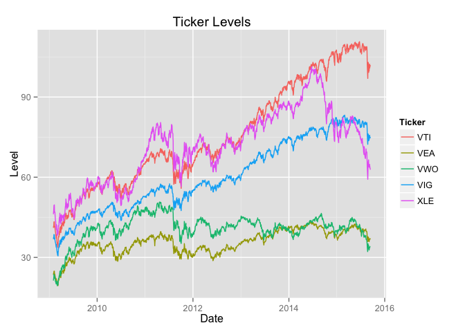
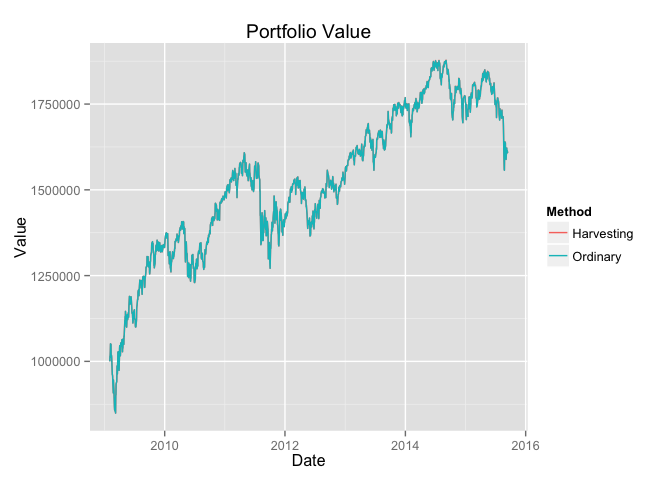

# Tax Loss Harvesting 2
## Synopsis
One day I may fill this out.

## Code Horrors

```r
library(dplyr)
library(reshape2)
library(ggplot2)
```
### What's the aim
And another day this.

### The Global Scope
What we need really calls for classes and objects but since I haven't yet gotten that far in R, instead we use it's older, prodigal brother, The Global Scope.

The following variables are used for each simulation to store data that is shared and modified by the various methods. They need to be reset between each run.

```r
capital_gains_tax <- NULL # Tax rate, e.g., 0.25
capital_gain_loss <- NULL # Stores what PNL is not yet taxed/used to offset gains
buy_history <- NULL # list of ticker -> list of quantity and buy price (arrays of equal length)
last_tax_year <- NULL # last year we paid tax, we pay tax on the first business day of each year
```


```r
#' reset_global_variables
#' 
#' Resets the global variables. MUST be called before each run.
reset_global_variables <- function(target_weights, prices, value=1e6, tax_rate=0.25) {
  capital_gains_tax <<- tax_rate
  capital_gain_loss <<- 0
  last_tax_year <<- NULL
  set_up_buyhistory(target_weights, prices, value)
}
```

### And now the rest of the code

```r
#' single_ticker_close_values
#'
#' Returns data frame with columns 'Date' and 'Close' for input ticker.
single_ticker_close_values <- function(ticker, from_year) {
  URL <- sprintf('http://ichart.finance.yahoo.com/table.csv?s=%s&a=1&b=1&c=%d&g=d&ignore=.csv', ticker, from_year)
  data <- read.csv(URL, stringsAsFactors=FALSE)
  data$Date <- as.Date(data$Date)
  data <- data[,c('Date', 'Close')]
  
  return(data)
}

#' rename_column
#'
#' Renames column in given data frame from oldname to newname. Returns data frame.
rename_column <- function( df, oldname, newname) {
  colnames <- names(df)
  colnames[which(colnames==oldname)] <- newname
  names(df) <- colnames
  
  return(df)
}

#' multiple_ticker_close_values
#'
#' Takes string vector of tickers and returns data frame with columns 'Date' and one for each ticker (named as ticker).
#' Only dates for which there are close values for all tickers are kept in the output.
#' Output data frame is sorted by date (ascending).
multiple_ticker_close_values <- function(tickers, from_year) {
  first_ticker <- tickers[1]
  data <- single_ticker_close_values(first_ticker,from_year)
  data <- rename_column(data, 'Close', first_ticker)
  
  tickers <- tickers[-1]
  for(t in tickers) {
    d <- single_ticker_close_values(t,from_year)
    d <- rename_column(d, 'Close', t)
    data <- inner_join(data, d, by='Date')
  }
  
  data <- arrange(data, Date)
  
  return(data)
}

#' calculate_quantities
#'
#' Takes buy_history, a list of ticker -> 2-element list of price/quantity (same length) and returns
#' a list of ticker -> quantity.
calculate_quantities <- function(buy_history) {
  lapply(buy_history, function(x) sum(x$quantity))
}

#' calculate_weights
#'
#' Takes list of ticker -> quantity, list/data frame row of ticker -> price
#' and returns list of ticker -> weight in portfolio.
calculate_weights <- function(quantities, prices) { 
  weights <- list()
  total <- 0
  tickers <- names(quantities)
  
  for(t in tickers) {
    weights[t] <- quantities[[t]] * prices[[t]]
    total <- total + weights[[t]]
  }
  
  lapply(weights, function(v) v/total)  
}

#' set_up_buyhistory
#' 
#' initializes buy_history (global scope) with the purchases needed to reach the target weights.
set_up_buyhistory <- function(target_weights, prices, value=1e6) {
  hist <- list()
  tickers <- names(target_weights)
  for(t in tickers) {
    price <- prices[[t]]
    quantity <- value / price * target_weights[[t]]
    hist[[t]] <- list(quantity=quantity, price=price)
  }
  
  buy_history <<- hist # Global assignment
}

#' do_rebalancing
#' 
#' Returns TRUE/FALSE depending on whether the portfolio should be rebalanced.
do_rebalancing <- function(weights) {
  max_weight <- NULL
  min_weight <- NULL
  maxmin <- function(w) {
    max_weight <<- max(max_weight, w)
    min_weight <<- min(min_weight, w)
  }
  lapply(weights, maxmin)
  
  max_weight - min_weight > 0.05
} 

#' do_taxes
#'
#' Returns TRUE if it's time to do taxes, otherwise "Balthazar!!!" 
#' No, I'm kidding. Otherwise it returns FALSE.
do_taxes <- function(date) {
  # First time called we initialize with the year.
  if(is.null(last_tax_year))
    last_tax_year <<- format(date,'%Y')
  
  current_year <- format(date,'%Y')
  
  if(current_year != last_tax_year) {
    last_tax_year <<- current_year
    return(TRUE)
  }
  
  return(FALSE)
}

#' calculate_total_value
#' 
#' Returns total portfolio value based on input quantities and prices.
calculate_total_value <- function(quantities, prices) { 
  total <- 0
  tickers <- names(quantities)
  for(t in tickers) 
    total <- total + quantities[[t]]*prices[[t]]
  
  total
}

#' calculate_termination_value
#'
#' How much money would you have in your hand if you threw a hissy fit and 
#' terminated the entire portfolio right now?
calculate_termination_value <- function(buy_history, prices, capital_gain_loss) {
  quantities <- calculate_quantities(buy_history)
  total_value <- calculate_total_value(quantities, prices)
  tickers <- names(quantities)
  
  PNL <- 0
  
  for(t in tickers) {
    hist <- buy_history[[t]]
    current_price <- prices[[t]]
    for(idx in 1:length(hist$quantity)) {
      PNL <- PNL + hist$quantity[idx] * (current_price - hist$price[idx])
    }
  }
  
  tax_to_pay <- max(capital_gain_loss + PNL,0)*capital_gains_tax
  
  total_value - tax_to_pay
}

#' transact_in_ticker
#' 
#' Buys or sells in given ticker the stated quantity at the stated price.
#' NOTE: This modifies 'capital_gain_loss' and 'buy_history' in the wider world.
transact_in_ticker <- function(ticker, quantity, price) {
  history <- buy_history[[ticker]]
  if(quantity>0) {
    history$quantity <- c(history$quantity, quantity)
    history$price    <- c(history$price, price)
   } else if(quantity<0) {
    indices_to_remove <- NULL
    for(idx in length(history$quantity):1) {
      transaction_q <- history$quantity[idx]
      transaction_p <- history$price[idx]
      
      if(transaction_q > -quantity) {
        history$quantity[idx] <- transaction_q + quantity
        capital_gain_loss <<- capital_gain_loss + (-quantity)*(price-transaction_p) # Global assignment
        break
      } else {
        indices_to_remove <- c(indices_to_remove, idx)
        quantity <- quantity + transaction_q #remember quantity < 0; bring closer to 0
        capital_gain_loss <<- capital_gain_loss + transaction_q*(price-transaction_p) # Global assignment      
      }     
    }
    
    if(!is.null(indices_to_remove)) {
      history$quantity <- history$quantity[-indices_to_remove]
      history$price <- history$price[-indices_to_remove]
    }
  }
  buy_history[[ticker]] <<- history #Global assignment
}

#' harvest
#'
#' Sells and rebuys (in a fictitious similar ticker) anything that has lost value since it was bought.
harvest <- function(current_prices) {
  tickers <- names(buy_history)
  for(t in tickers) {
    history <- buy_history[[t]]  
    price <- current_prices[[t]]
    
    buys_to_remove <- NULL
    quantity_to_buy <- 0
    for(idx in length(history$quantity):1) {
      bought_price <- history$price[idx]
      bought_quantity <- history$quantity[idx]
      
      if(bought_price > price) {
        buys_to_remove <- c(buys_to_remove, idx)
        quantity_to_buy <- quantity_to_buy + bought_quantity
        
        # Accumulate capital losses
        capital_gain_loss <<- capital_gain_loss + bought_quantity*(price-bought_price) # Global
      } else break
    }
    
    # If we discovered anything to sell out, sell and rebuy
    if(!is.null(buys_to_remove)) {
      history$quantity <- history$quantity[-buys_to_remove]
      history$price <- history$price[-buys_to_remove]
      
      buy_history[[t]] <<- history # Global
      transact_in_ticker(t, quantity_to_buy, price) # Now rebuy the sold out quantity
    }
  }
}

#' run_simulation
#'
#' Returns list with all the data your heart desires (assuming you want a black Ford T)
run_simulation <- function(
 tickers, # vector of tickers
 do_harvest=TRUE, # whether to do tax-loss harvesting
 starting_value=1e6,
 tax_rate=0.25,
 starting_year=2009
) {  
  df <- multiple_ticker_close_values(tickers, starting_year) 
  
  # Equi-weighted portfolio
  intended_weights <- sapply(tickers, function(x) 1/length(tickers))
  
  reset_global_variables(intended_weights, df[1,], starting_value, tax_rate)
  
  values <- NULL # Vector of values assuming the portfolio was terminated (and thus subject to tax)
  pretax_values <- NULL # Vector of current value of portfolio (pre-tax)
  gain_loss_history <- NULL # Vector of accumulated capital gains/losses
  taxes_paid <- NULL # Vector of the taxes paid (variable length)
  
  for(index in 1:dim(df)[1]) {
    row <- df[index,]
    current_date <- row$Date
    current_quantities <- calculate_quantities(buy_history)
    current_weights <- calculate_weights(current_quantities, row)
    
    tax_time <- do_taxes(current_date) #Remembers year so can only be called once per date
    gain_loss_history <- c(gain_loss_history, capital_gain_loss)
    
    # Rebalance portfolio on sunny days
    if(do_rebalancing(current_weights) || tax_time) {
      total_value <- calculate_total_value(current_quantities, row)
      
      if(do_harvest) {
        harvest(row)
      }  
      
      # Now we rebalance
      for(t in tickers) {
        intended_quantity <- total_value * intended_weights[[t]] / row[[t]]
        to_buy_quantity <- intended_quantity - current_quantities[[t]]
        current_price <- row[[t]]
        
        transact_in_ticker(t, to_buy_quantity, current_price) 
      }
    }
    
    if(tax_time){
      if(capital_gain_loss > 0) {
        tax_to_pay <- capital_gains_tax * capital_gain_loss
        taxes_paid <- c(taxes_paid, tax_to_pay)
        
        capital_gain_loss <<- 0
        
        current_quantities <- calculate_quantities(buy_history)
        current_value <- calculate_total_value(current_quantities, row)
        if(tax_to_pay > current_value)
          stop( "Not enough money to pay tax")
        
        tax_per_ticker <- tax_to_pay / length(tickers)
        
        for(t in tickers) {
          current_price <- row[[t]]
          transact_in_ticker(t, -tax_per_ticker/current_price, current_price)
        }
      } 
    }
    
    # Calculate investment value
    quantities <- calculate_quantities(buy_history)
    total_value <- calculate_termination_value(buy_history, row, capital_gain_loss)
    values <- c(values, total_value)
    pretax_values <- c(pretax_values, calculate_total_value(quantities, row))
  }
  
  list(
    dates=df$Date,
    values=values,
    gain_loss_history=gain_loss_history,
    taxes_paid=taxes_paid
  )
}

#' print_analysis
#' 
#' Plots relevant graphs and outputs a few numbers.
print_analysis <- function(
  tickers, # vector of tickers
  starting_value=1e6,
  tax_rate=0.25,
  starting_year=2009
) { 
  data <- multiple_ticker_close_values(tickers, starting_year )
  data <- melt(data, id.vars='Date', variable.name='Ticker', value.name='Level')
  ticker_plot <- ggplot(data) + aes(x=Date, y=Level, colour=Ticker) + geom_line() + ggtitle('Ticker Levels')
  print(ticker_plot)
  
  harvest  <- run_simulation(tickers, do_harvest=TRUE, starting_value=starting_value, tax_rate=tax_rate, starting_year=starting_year)
  ordinary <- run_simulation(tickers, do_harvest=FALSE, starting_value=starting_value, tax_rate=tax_rate, starting_year=starting_year)
  
  value_data <- data.frame(Date=harvest$dates, Harvesting=harvest$values, Ordinary=ordinary$values)
  value_data <- melt(value_data, id.vars='Date', variable.name='Method', value.name='Value')
  value_plot <- ggplot(value_data) + aes(x=Date, y=Value, colour=Method) + geom_line() + ggtitle('Portfolio Value')
  
  print(value_plot)
  
  #
  # Some simple stats
  #
  time_diff <- difftime(max(harvest$dates), min(harvest$dates), units='days')
  time_in_years <- as.numeric(time_diff)/365.25
  
  harvest_start <- harvest$values[1]
  harvest_end <- tail(harvest$values,n=1)
  harvest_multiplier <- harvest_end/harvest_start
  
  ordinary_start <- ordinary$values[1]
  ordinary_end <- tail(ordinary$values,n=1)
  ordinary_multiplier <- ordinary_end/ordinary_start
  
  # Using continuous compounding
  harvest_yield <- log(harvest_multiplier)/time_in_years
  ordinary_yield <- log(ordinary_multiplier)/time_in_years
  
  print(sprintf('Value went from %0.f to %0.f with tax harvesting', harvest_start, harvest_end))
  print(sprintf('Value went from %0.f to %0.f without tax harvesting', ordinary_start, ordinary_end))
  print(sprintf('Yield (continuous compounding) with harvesting: %f', harvest_yield))
  print(sprintf('Yield (continuous compounding) without harvesting: %f', ordinary_yield))
  print(sprintf('Yearly difference in basis points: %0.f', 1e4*(harvest_yield-ordinary_yield)))
}
```

## Various Attempts
### One

```r
print_analysis(c('SPY', 'EZU', 'GDX'),starting_year=2009)
```

  

```
## [1] "Value went from 1000000 to 1188894 with tax harvesting"
## [1] "Value went from 1000000 to 1174821 without tax harvesting"
## [1] "Yield (continuous compounding) with harvesting: 0.026168"
## [1] "Yield (continuous compounding) without harvesting: 0.024368"
## [1] "Yearly difference in basis points: 18"
```

### Two

```r
print_analysis(c('VTI', 'VEA', 'VWO', 'VIG', 'XLE'),starting_year=2009)
```

  

```
## [1] "Value went from 1000000 to 1607909 with tax harvesting"
## [1] "Value went from 1000000 to 1607589 without tax harvesting"
## [1] "Yield (continuous compounding) with harvesting: 0.071830"
## [1] "Yield (continuous compounding) without harvesting: 0.071800"
## [1] "Yearly difference in basis points: 0"
```
